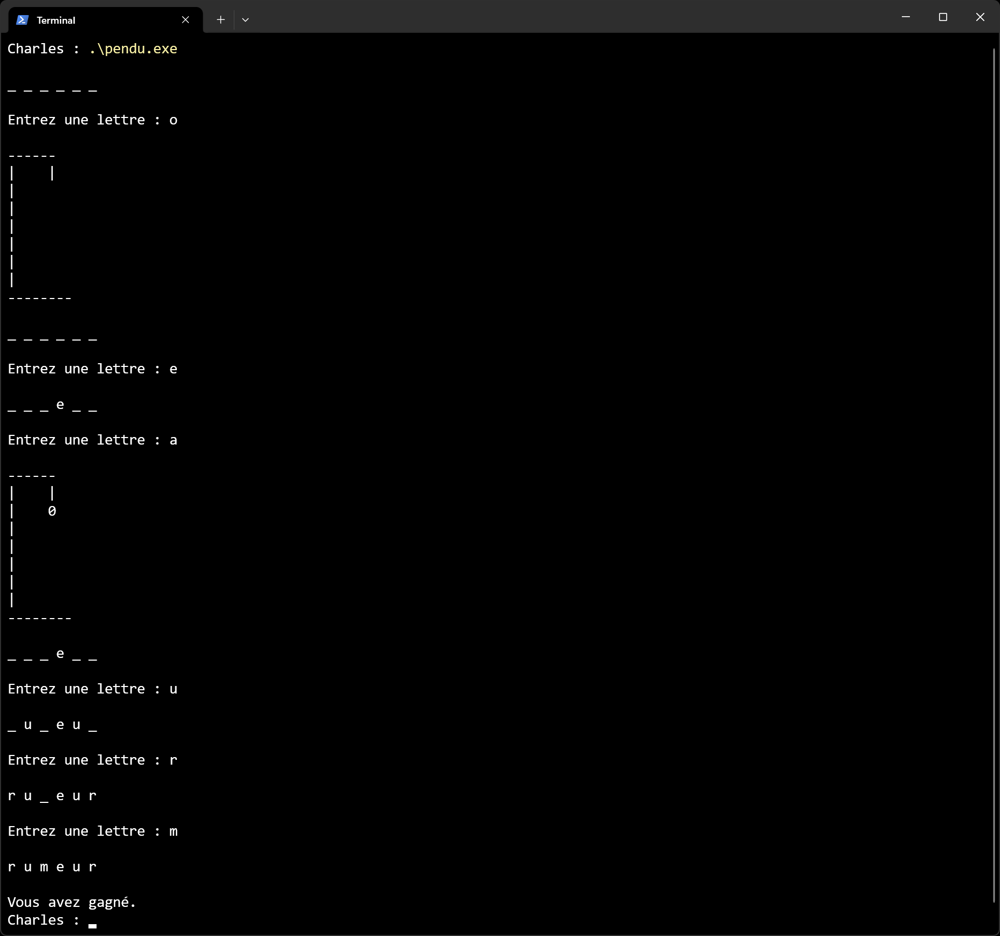
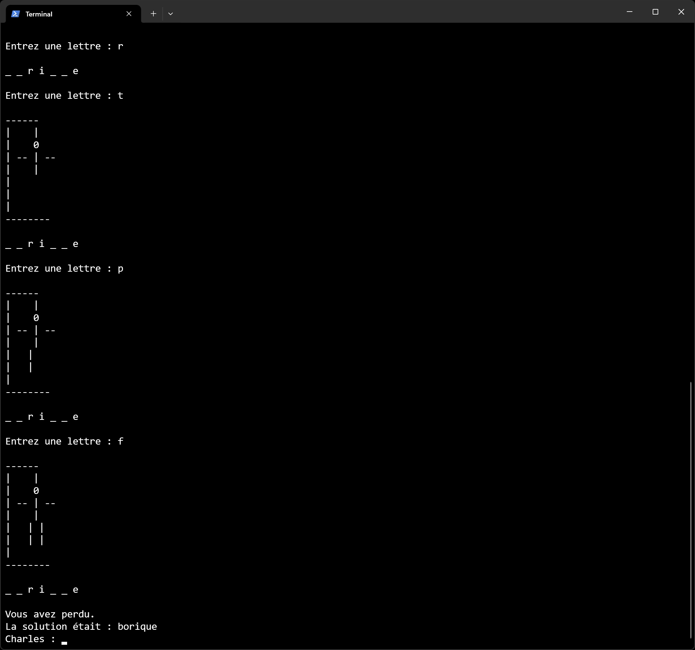

# Jeu du Pendu

## Présentation

Ce dépôt est un dépôt pédagogique de présentation. Il présente les fonctionnalités du projet,
des exemples d'exécution, mais ne fournit pas le code source complet du programme. Une discussion
est ouverte pour les personnes ayant des questions d'ordre général ou techniques sur son écriture.

## Description

L'objectif de ce projet est de fournir une implémentation fonctionnelle du jeu du Pendu.

Les fonctionnalités sont les suivantes :

- Jeu en mode console avec interface textuelle
- Sélection de mots à partir d'un fichier texte
- Affichage progressif du pendu en ASCII art
- Dictionnaire français intégré de base
- Possibilité de paramétrer un dictionnaire
- Support basique de l'internationalisation

Le programme est écrit en Rust.

## Aperçu

Exemples d'exécution du programme :

<table>
    <tr>
        <td></td>
        <td></td>
    </tr>
</table>

## Notes

Le projet est simple, idéal pour débuter, et ne demande que les connaissances de base du langage dans
lequel on écrit le programme. Par ailleurs, il est amusant tout en étant utile, et permet de tester
ses connaissances en vocabulaire.

## Auteur

© Charles Theetten. Tous droits réservés.

##
